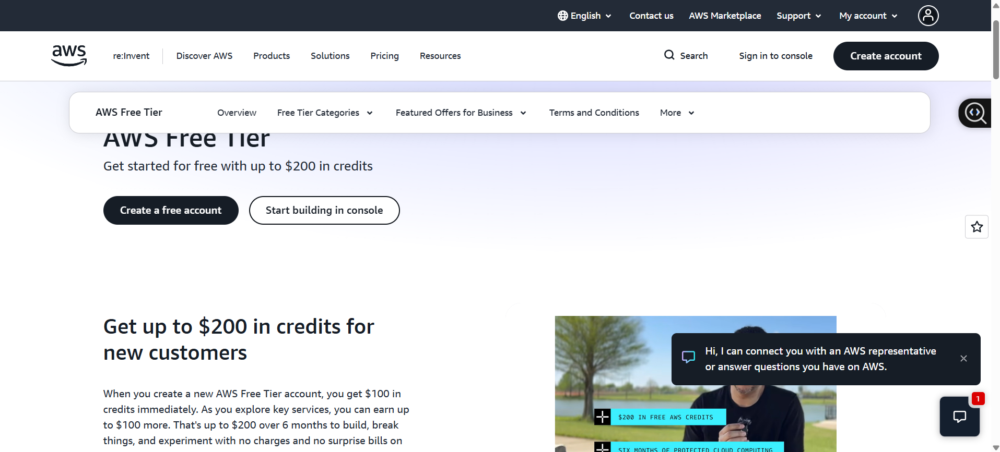

# AWS Research

## Brief Overview
Amazon Web Services, or AWS, is Amazon's cloud computing platform. It provides a very large selection of cloud services, including computing, storage, databases, networking, security, and AI. AWS has more than 200 services available.   

## Global Infrastructure
AWS has infrastructure around the world divided into Regions and Availability Zones. Regions are separate geographic areas, while Availability Zones are isolated locations within a region. This helps businesses improve availability and reliability.   

## Cloud Management Console
AWS uses the AWS Management Console. It is a web-based interface that allows users to find services, create resources, monitor systems, and manage their AWS account.  

## Four (4) Core Services
1. Amazon EC2 – Provides virtual servers.  
2. Amazon S3 – Provides object storage for files and data.  
3. Amazon RDS – Provides managed relational databases.  
4. Amazon EKS – Provides managed Kubernetes clusters.   

## Three (3) Advantages
1. Very large selection of cloud services.  
2. Strong global infrastructure.  
3. Flexible pricing and the ability to scale resources when needed.    
 
## Typical Enterprise Use Cases 
Hosting websites and applications. 

Moving existing systems to the cloud. 

Data storage and backup. 

Running large databases. 

Using AI and machine learning services. 

Disaster recovery. 
 
## Screenshot 

