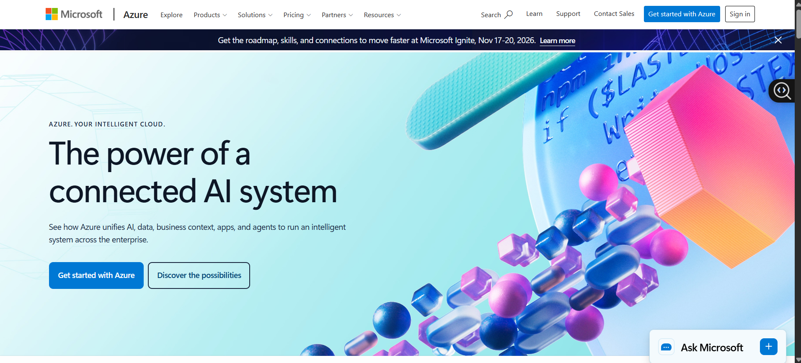

# Microsoft Azure Research

## Brief Overview
Microsoft Azure is a cloud computing platform created by Microsoft. It provides services for computing, storage, databases, networking, security, AI, and application development. It is commonly used by businesses that already use Microsoft products.  

## Global Infrastructure
Azure has a large worldwide infrastructure with 80+ regions and 500+ datacenters. Its regions help businesses place applications and data closer to their customers and meet data residency requirements.  

## Cloud Management Console
Azure uses the Azure Portal. It is a web-based console where users can create, monitor, and manage virtual machines, storage, networks, applications, and other Azure services.   

## Four (4) Core Services
1. Azure Virtual Machines – Runs virtual computers in the cloud.  
2. Azure Blob Storage – Stores files and other unstructured data.  
3. Azure SQL Database – Managed SQL database service.  
4. Azure Kubernetes Service (AKS) – Runs and manages containerized applications using Kubernetes.  

## Three (3) Advantages
1. Strong integration with Microsoft products such as Windows and Microsoft 365.  
2. Large global infrastructure and many regions.  
3. Good security and enterprise management features.  

## Typical Enterprise Use Cases
Moving company servers to the cloud. 

Hosting business applications and websites. 

Running Microsoft-based applications. 

Data backup and disaster recovery. 

AI and data analytics. 
 
## Screenshot 

