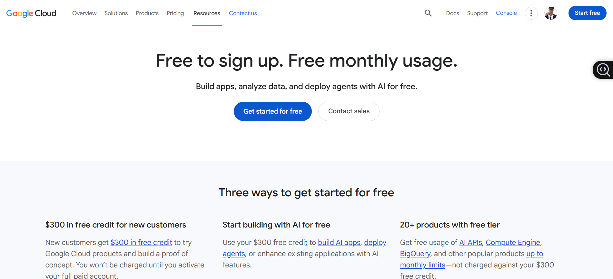

# Google Cloud Platform Research

## Brief Overview

Google Cloud Platform, usually called Google Cloud, is Google's cloud computing platform. It provides services for computing, storage, databases, networking, data analytics, containers, and AI.  

## Global Infrastructure
Google Cloud operates infrastructure across 43 global regions and 130 zones, covering six continents. Its global network is designed to provide good performance and low latency for users around the world.  

## Cloud Management Console
Google Cloud uses the Google Cloud Console. It is a web-based interface used to create and manage cloud resources. Users can also manage services through the Google Cloud CLI and APIs.   

## Four (4) Core Services
1. Compute Engine – Provides virtual machines.  
2. Cloud Storage – Provides scalable object storage.  
3. Cloud SQL – Provides managed relational databases.  
4. Google Kubernetes Engine (GKE) – Provides managed Kubernetes for container applications.   

## Three (3) Advantages
1. Strong AI and machine learning capabilities.  
2. Google's fast global network.  
3. Good tools for data analytics and large-scale data processing.  

## Typical Enterprise Use Cases
AI and machine learning projects. 

Big data and business analytics. 

Hosting web applications. 

Running containerized applications. 

Migrating virtual machines and applications to the cloud. 
 
## Screenshot 

