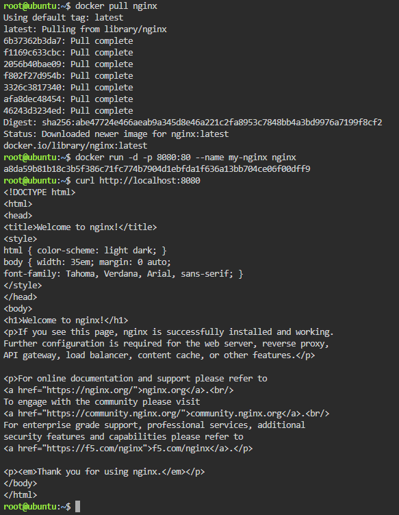
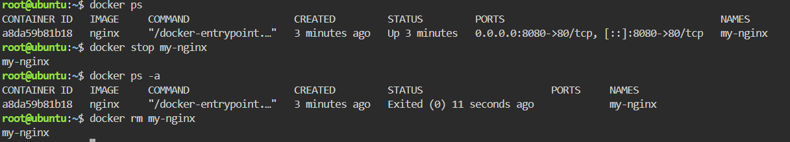

# Docker Deployment Log

## Container Deployment (Checkpoint 4)

| Command | Purpose |
|---|---|
| `docker pull nginx` | Downloads the official Nginx image from Docker Hub. |
| `docker run -d -p 8080:80 --name my-nginx nginx` | Runs the Nginx container in detached mode, mapping host port 8080 to container port 80. |
| `curl http://localhost:8080` | Sends an HTTP request to confirm the Nginx web server is running and accessible. |

## Container Lifecycle (Checkpoint 5)

| Command | What It Did |
|---|---|
| `docker ps` | Listed all currently running containers, confirming `my-nginx` was active. |
| `docker stop my-nginx` | Gracefully stopped the running `my-nginx` container. |
| `docker ps -a` | Verified the container was stopped by showing it with an "Exited" status. |
| `docker rm my-nginx` | Permanently removed the stopped container from the system. |

