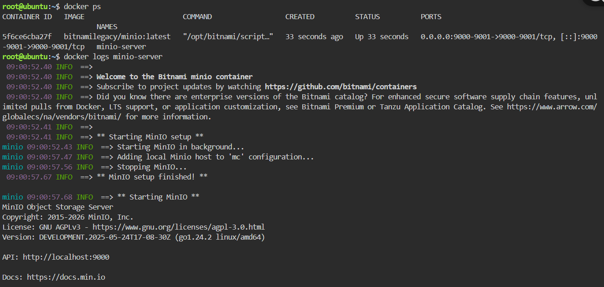
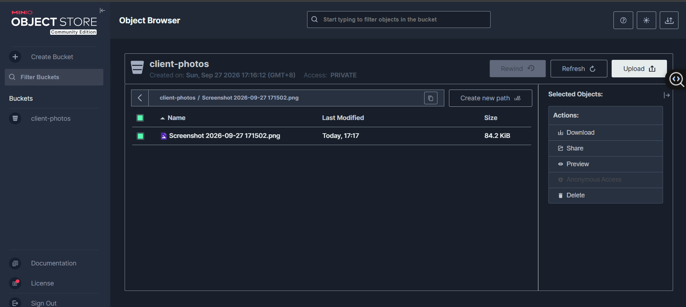

# MinIO Deployment Documentation

## Docker Command Used

docker run -d -p 9000:9000 -p 9001:9001 --name minio-server
--user 0:0
--entrypoint minio
-e "MINIO_ROOT_USER=cloudadmin"
-e "MINIO_ROOT_PASSWORD=CloudNova2026!"
bitnamilegacy/minio:latest server /data --console-address ":9001"

## Note on Docker Image Source
The lab instructions originally specified the minio/minio image. However, as of 
late 2025/2026, MinIO removed anonymous public access to its Community Edition images 
on both Docker Hub (minio/minio) and quay.io (quay.io/minio/minio), returning 
"pull access denied" and "unauthorized" errors respectively. To complete this 
deployment, the bitnamilegacy/minio:latest image was used instead. Additionally, 
this image required overriding the container's entrypoint directly to the minio 
binary and passing the server command and console-address flag explicitly, since 
Bitnami's default startup script did not enable the web console automatically.

## Web Console Access
The MinIO Web Console was accessed through port 9001, opened via the KillerCoda Playground's Traffic/Ports panel.

## Bucket Created
A bucket named client-photos was created to store the client's user-uploaded images.

## Environment Variables Explained
The -e flags in the Docker command set environment variables inside the container at runtime:
- MINIO_ROOT_USER=cloudadmin — sets the root administrator username used to log into the MinIO web console.
- MINIO_ROOT_PASSWORD=CloudNova2026! — sets the root administrator password used alongside the username to authenticate access to the MinIO server.

These environment variables allow the MinIO server to be configured securely at startup without hardcoding credentials into the container image itself.

## Screenshots

